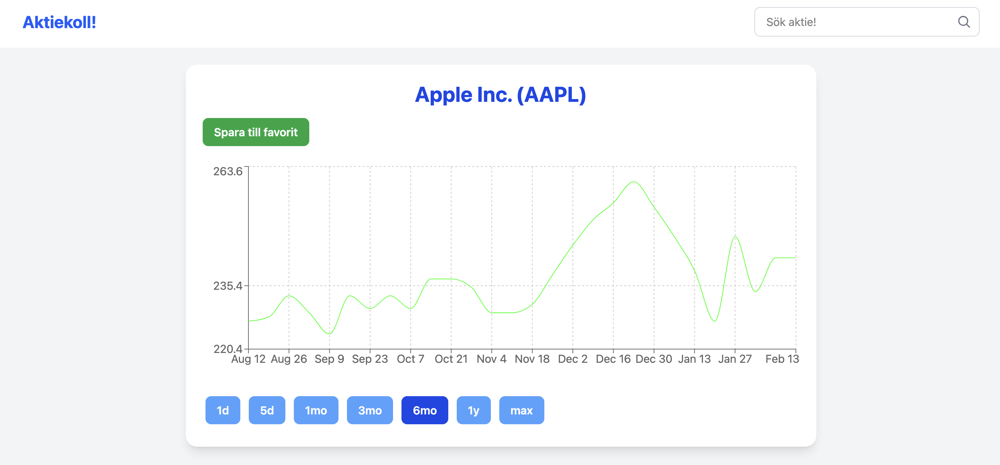

# Aktiekoll

På aktiekoll kan du söka efter aktier och se prisutveckling över tid med hjälp av diagram. Webbplatsens frontend är byggd med React och Vite, med diagramrendering med Recharts. Backend är en API-server byggd med Express, som ansluter till Yahoo Finance API för att hämta aktiedata.



## Funktioner

-   **Sök efter aktier**: Använd sökfunktionen för att hitta specifika aktier.
-   **Interaktiva diagram**: Visualisera aktieprestanda med interaktiva diagram byggda med Recharts.
-   **Responsiv design**: Webbplatsen är responsiv och fungerar bra på både desktop och mobilenheter.

## Stack

-   **Frontend**:
    -   React
    -   Vite
    -   Tailwind CSS
    -   Recharts
-   **Backend**:
    -   Express
    -   Yahoo Finance API

## Installation

Följ dessa steg för att sätta upp projektet lokalt:

1. **Klona repot**:

    ```bash
    git clone https://github.com/edwjoh/aktie.git
    cd aktie
    ```

2. **Installera dependencies för frontend**:

    ```bash
    cd frontend
    npm install
    ```

3. **Installera dependencies för backend**:
    ```bash
    cd ../backend
    npm install
    ```
4. **Starta backend-servern**:

    ```bash
    node server.js
    ```

5. **Starta frontend-utvecklingsservern**:

    ```bash
    cd ../frontend
    npm run dev
    ```

6. **Öppna webbplatsen**:
   Öppna din webbläsare och gå till `http://localhost:5173` för att se webbplatsen.

## Licens

Detta projekt är licensierat under MIT-licensen - se filen [LICENSE](LICENSE) för detaljer.

## Kontakt

Om du har frågor eller feedback, kontakta mig gärna via [email](mailto:edwa.joha@gmail.com).
